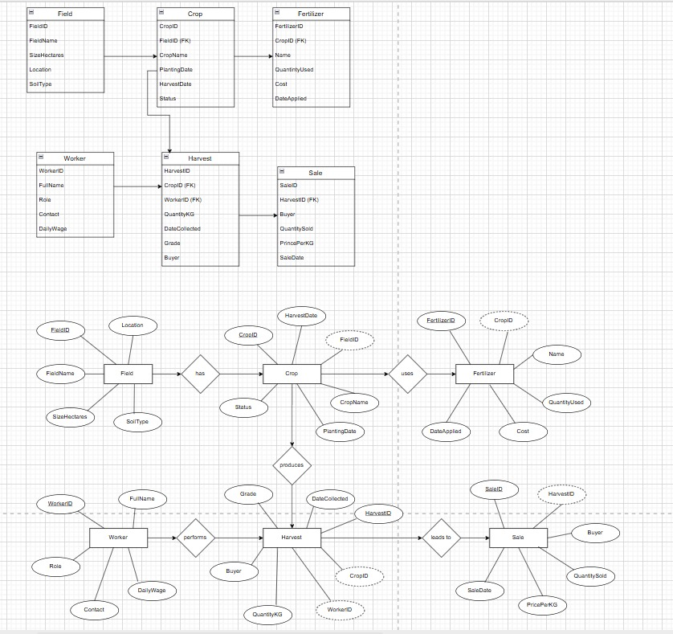

# Agricultural Farm Production and Supply Management System

## Introduction

The **Agricultural Farm Production and Supply Management System** is a database-driven project designed to help farmers and agricultural organizations effectively manage and monitor their farming activities. 

This system records and organizes essential information about **fields, crops, fertilizers, workers, harvests, and sales transactions**, enabling users to track all stages of farm production from planting to sale.

By maintaining accurate data on input costs, harvest yields, and sales performance, the system helps farmers **evaluate production efficiency**, **reduce input waste**, and **maximize profits** for each crop and field across planting seasons.

## Entity Relationship Diagram

